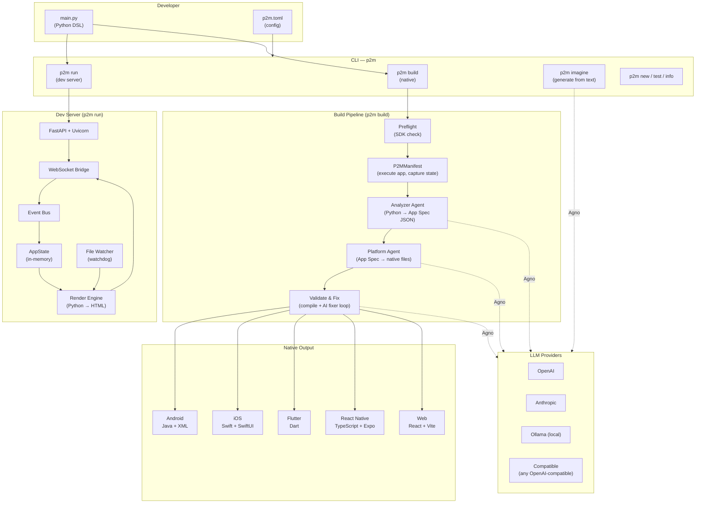
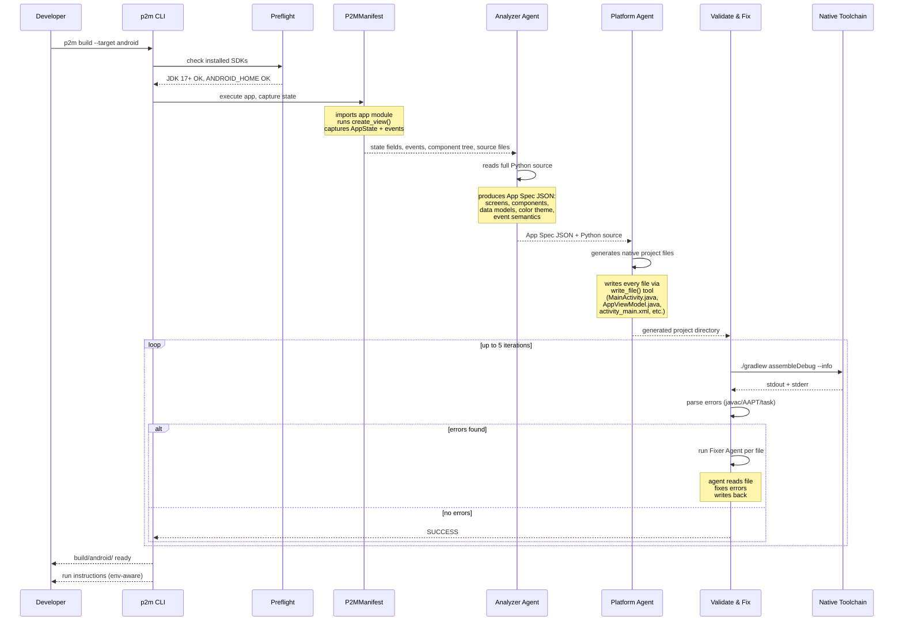
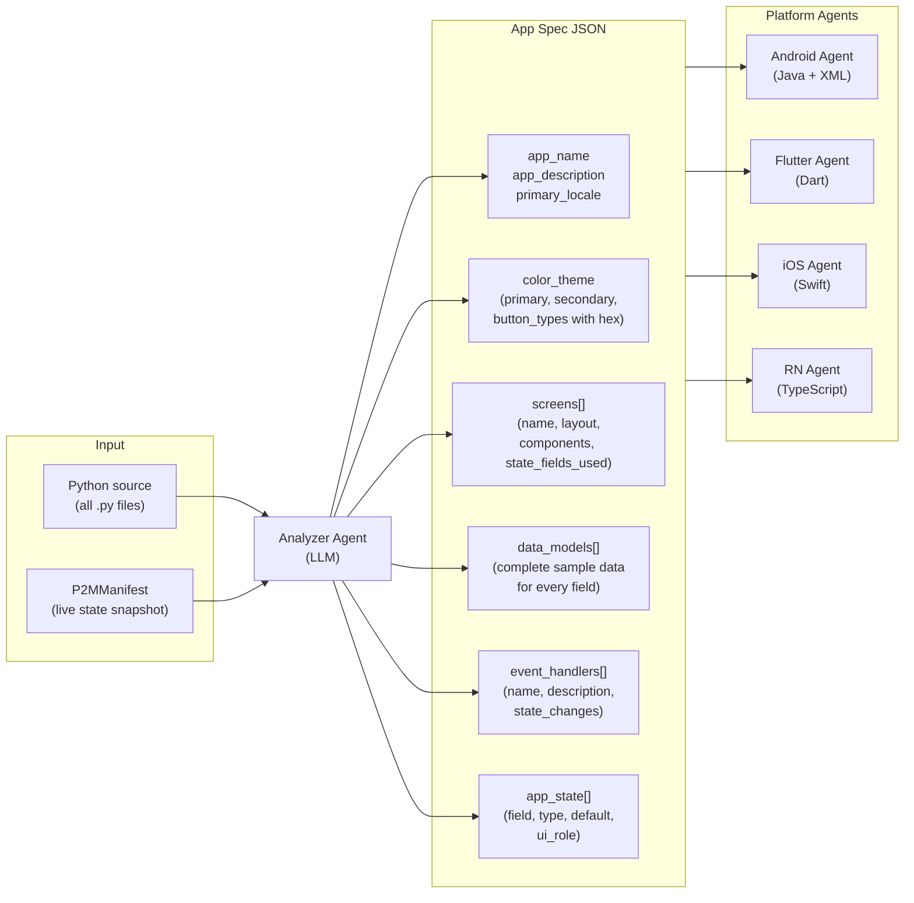
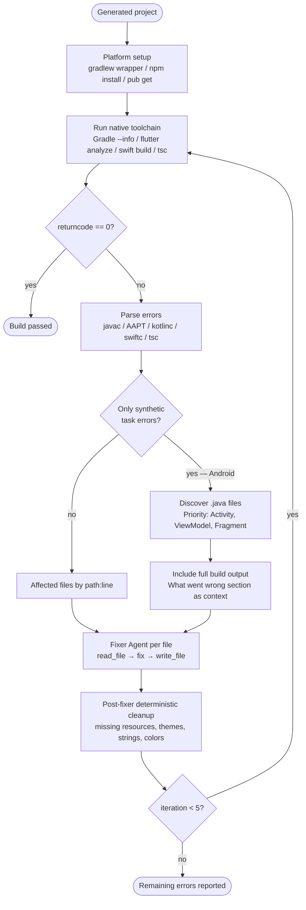
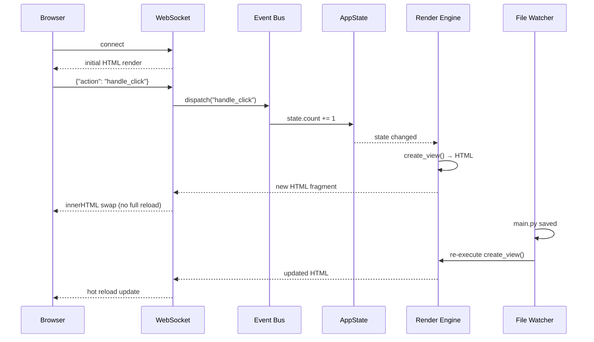

# Python2Mobile (P2M)

> Write mobile apps in **pure Python**. Generate production-ready native code for Android, iOS, Flutter and React Native — powered by AI agents.

[](https://pypi.org/project/python2mobile/)
[](https://python.org)
[](https://opensource.org/licenses/MIT)
[]()

---

## Overview

P2M is a framework with two distinct modes:

1. **Dev mode** (`p2m run`) — renders your Python app as a live web preview with hot reload via FastAPI + WebSocket
2. **Build mode** (`p2m build`) — a 3-phase AI agent pipeline that generates 100% compilable native code, compiles it, and auto-fixes errors until the build passes

You write Python. P2M ships native code.

---

## Architecture



---

## Build Pipeline — 3 Phases



---

## Repository Structure

```
python2mobile/
│
├── python2mobile/              # Python package (library + CLI)
│   └── p2m/
│       ├── __init__.py         # Public API: Render, Container, Text, Button...
│       ├── cli.py              # CLI entry point (click): run, build, new, imagine, test, info
│       ├── config.py           # p2m.toml parser: ProjectConfig, BuildConfig, LLMConfig...
│       │
│       ├── core/               # Runtime kernel
│       │   ├── runtime.py      # Render.execute() — main render loop
│       │   ├── render_engine.py# Python component tree → HTML string
│       │   ├── ast_walker.py   # AST analysis utilities
│       │   ├── state.py        # AppState — simple key-value reactive store
│       │   ├── events.py       # Event bus: register(), dispatch()
│       │   ├── validator.py    # Python source validation (pre-build checks)
│       │   ├── api.py          # REST API helpers
│       │   └── database.py     # Simple local DB abstraction
│       │
│       ├── ui/                 # Declarative component library
│       │   └── components.py   # Container, Text, Button, Input, Image, List,
│       │                       # Navigator, Screen, Modal, ScrollView, Carousel,
│       │                       # Row, Column, Card, Badge, Icon
│       │
│       ├── build/              # Code generation pipeline
│       │   ├── agent_generator.py   # AgentCodeGenerator — orchestrates the 3 phases
│       │   ├── generator.py         # Legacy LLM generator (fallback)
│       │   ├── manifest.py          # P2MManifest — executes app, captures state/events
│       │   ├── preflight.py         # Native SDK presence checks (flutter, java, node...)
│       │   │
│       │   └── agent/               # Agno agent layer
│       │       ├── base.py              # build_model(), build_prompt() helpers
│       │       ├── tools.py             # read_file / write_file / list_files tools
│       │       ├── analyzer_agent.py    # Phase 1: Python → App Spec JSON
│       │       ├── android_agent.py     # Phase 2: App Spec → Java + XML Android project
│       │       ├── flutter_agent.py     # Phase 2: App Spec → Flutter/Dart project
│       │       ├── ios_agent.py         # Phase 2: App Spec → Swift/SwiftUI project
│       │       ├── react_native_agent.py# Phase 2: App Spec → React Native/Expo project
│       │       ├── web_agent.py         # Phase 2: App Spec → React/Vite web project
│       │       └── validator_agent.py   # Phase 3: compile + parse errors + AI fixer loop
│       │
│       ├── devserver/          # Live preview server
│       │   └── server.py       # FastAPI + WebSocket + file watcher
│       │
│       ├── llm/                # LLM provider abstraction
│       │   ├── factory.py      # LLMFactory — builds provider from config
│       │   ├── base.py         # BaseLLMProvider interface
│       │   ├── openai_provider.py
│       │   ├── anthropic_provider.py
│       │   ├── ollama_provider.py
│       │   └── compatible_provider.py  # Any OpenAI-compatible endpoint
│       │
│       ├── imagine/            # Generate full P2M project from text description
│       │   ├── agent.py        # Agno-based imagine agent
│       │   └── legacy.py       # Legacy LLM-based imagine
│       │
│       ├── i18n/               # Internationalisation
│       │   └── translator.py   # configure(), t(), set_locale()
│       │
│       └── testing/            # Test utilities
│           └── __init__.py     # render_test(), render_html(), dispatch()
│
├── p2m-docs/                   # Documentation site
│   └── client/src/
│       ├── App.tsx             # Router (wouter): /, /docs/*, /404
│       ├── contexts/           # LanguageContext (EN/PT), ThemeContext
│       ├── components/         # DocsLayout, CodeBlock, MermaidDiagram
│       └── pages/docs/         # GettingStarted, Installation, AllPlatforms,
│                               # Validation, Troubleshooting, Architecture...
│
└── examples-p2m/               # Example apps
    └── calculator_app/         # Calculator — demonstrates state + events + build
        ├── main.py
        ├── p2m.toml
        └── build/              # Generated native output (gitignored)
            ├── android/        # Java + XML Android project
            ├── ios/            # Swift/SwiftUI project
            ├── flutter/        # Dart/Flutter project
            └── react-native/   # TypeScript/Expo project
```

---

## App Spec — The Central Artifact

The **Analyzer Agent** is the bridge between Python source and native code. It produces a structured JSON spec that every Platform Agent consumes:



---

## Validate & Fix Loop



---

## Android Platform — Java + XML

The Android agent generates a complete **MVVM** project using pure Java and XML layouts. Kotlin is only used in Gradle build scripts (Kotlin DSL for build configuration — not app code).

```mermaid
graph TB
    subgraph AgentOutput["Files generated by Android Agent"]
        direction TB
        SETTINGS["settings.gradle.kts<br/>(rootProject.name + include ':app')"]
        ROOT_GRADLE["build.gradle.kts<br/>(AGP 8.3.2, no Kotlin plugin)"]
        APP_GRADLE["app/build.gradle.kts<br/>(Java, viewBinding=true, Material 1.11)"]
        MANIFEST["AndroidManifest.xml"]
        MAIN_ACT["MainActivity.java<br/>(ViewBinding inflate, LiveData observe,<br/>button wiring)"]
        VM["AppViewModel.java<br/>(MutableLiveData<T> per state field,<br/>public getters, event methods)"]
        LAYOUT["activity_main.xml<br/>(LinearLayout, layout_weight for equal cols)"]
        COLORS["res/values/colors.xml<br/>(all hex values — no hardcoded hex in Java)"]
        THEMES["res/values/themes.xml<br/>(Theme.App, CalcButton.Digit/Function/Operator)"]
        STRINGS["res/values/strings.xml"]
    end

    subgraph Runtime["Runtime pattern"]
        VM2["AppViewModel<br/>MutableLiveData&lt;String&gt; display<br/>MutableLiveData&lt;Boolean&gt; isError"]
        ACT["MainActivity<br/>binding = ActivityMainBinding.inflate()<br/>viewModel.getDisplay().observe(this, ...)"]
        XML["activity_main.xml<br/>&lt;LinearLayout android:layout_weight='1'&gt;"]
    end

    subgraph JDK["JDK Detection (validator_agent.py)"]
        CUR["Current JAVA_HOME"]
        GRAAL{GraalVM?}
        DISC["_discover_all_jdks()<br/>macOS: /usr/libexec/java_home -V<br/>macOS: /Library/Java/JavaVirtualMachines/*<br/>Linux: /usr/lib/jvm/*<br/>SDKMAN: ~/.sdkman/candidates/java/*"]
        BEST["Best non-GraalVM JDK<br/>(highest version >= 11)"]
        AGP{version >= 17?}
        AGP83["AGP 8.3.2"]
        AGP74["AGP 7.4.2"]
        GPROPS["gradle.properties<br/>org.gradle.java.home=<path>"]
    end

    VM2 <--> ACT
    ACT --> XML

    CUR --> GRAAL
    GRAAL -->|yes| DISC
    GRAAL -->|no| BEST
    DISC --> BEST
    BEST --> AGP
    AGP -->|yes| AGP83
    AGP -->|no| AGP74
    GRAAL -->|yes| GPROPS
```



---

## Dev Server Flow



---

## Installation

```bash
pip install python2mobile
pip install agno          # AI agent support (required for p2m build)
```

### LLM API key

```bash
# OpenAI (recommended)
export OPENAI_API_KEY="sk-..."

# Anthropic
export ANTHROPIC_API_KEY="sk-ant-..."

# Ollama (local, no key needed)
export OLLAMA_BASE_URL="http://localhost:11434"
```

---

## Quick Start

### 1. Create a project

```bash
p2m new myapp
cd myapp
```

### 2. Write your app (`main.py`)

```python
from p2m.core import Render, events
from p2m.ui import Column, Text, Button
from p2m.core.state import AppState

state = AppState(count=0)

def handle_click():
    state.count += 1

events.register("handle_click", handle_click)

def create_view():
    root = Column(class_="flex flex-col items-center gap-4 p-8")
    root.add(Text(f"Count: {state.count}", class_="text-3xl font-bold"))
    root.add(Button("Increment", class_="bg-blue-600 text-white px-6 py-3 rounded-xl", on_click="handle_click"))
    return root.build()

def main():
    Render.execute(create_view)
```

### 3. Preview in browser

```bash
p2m run
# → http://localhost:3000
```

### 4. Generate native app

```bash
p2m build --target android      # Java + XML
p2m build --target ios          # Swift + SwiftUI
p2m build --target flutter      # Dart
p2m build --target react-native # TypeScript + Expo
```

### 5. Generate project from a description

```bash
p2m imagine "a todo app with categories, due dates and dark mode"
```

---

## Configuration (`p2m.toml`)

```toml
[project]
name = "MyApp"
version = "0.1.0"
entry = "main.py"

[build]
target = ["android", "ios"]
llm_provider = "openai"       # openai | anthropic | ollama | compatible
llm_model = "gpt-4o"
output_dir = "./build"
cache = true

[devserver]
port = 3000
hot_reload = true
mobile_frame = true

[style]
system = "tailwind"

# Optional: per-provider config
[llm.openai]
api_key = "sk-..."
model = "gpt-4o"

[llm.anthropic]
api_key = "sk-ant-..."
model = "claude-sonnet-4-6"

[llm.ollama]
base_url = "http://localhost:11434"
model = "qwen3-coder:latest"
```

---

## Platform Support

| Platform | Language | UI | State | Toolchain |
|---|---|---|---|---|
| Android | Java | XML + ViewBinding | ViewModel + LiveData | JDK 17+ (Temurin) |
| iOS | Swift | SwiftUI | ObservableObject + @Published | Xcode / Swift CLI |
| Flutter | Dart | Material / Cupertino | ChangeNotifier | Flutter SDK |
| React Native | TypeScript | RN + Expo SDK 54 | Context + useReducer | Node.js 18+ |
| Web | TypeScript | React + Vite | Context + useReducer | Node.js 18+ |

### Android prerequisites

```bash
# macOS — JDK Temurin 17 (not GraalVM)
brew install --cask temurin@17
brew install --cask android-commandlinetools

export ANDROID_HOME=$(brew --prefix)/share/android-commandlinetools
export PATH=$ANDROID_HOME/emulator:$ANDROID_HOME/platform-tools:$ANDROID_HOME/cmdline-tools/latest/bin:$PATH
export JAVA_HOME=$(/usr/libexec/java_home -v 17)

# Install platform + create emulator (x86_64 on Intel Mac, arm64-v8a on Apple Silicon)
sdkmanager "platforms;android-34" "build-tools;34.0.0"
sdkmanager "system-images;android-34;google_apis;x86_64"
avdmanager create avd -n Pixel_9 -k "system-images;android-34;google_apis;x86_64" -d "pixel_9"
```

> **Note:** GraalVM is not supported as build JDK. P2M auto-detects GraalVM and redirects Gradle to the best available standard JDK. Install Temurin to avoid this fallback.

---

## CLI Reference

| Command | Description |
|---|---|
| `p2m run` | Start dev server with hot reload (default port 3000) |
| `p2m build --target <platform>` | Generate and compile native code |
| `p2m new <name>` | Scaffold a new project |
| `p2m imagine "<description>"` | Generate a full project from natural language |
| `p2m test [path]` | Run tests with pytest |
| `p2m info` | Show project and environment info |

---

## UI Components

| Component | Description |
|---|---|
| `Column` | Vertical flex container |
| `Row` | Horizontal flex container |
| `Container` | Generic wrapper with direction + scroll |
| `Card` | Elevated surface container |
| `Text` | Styled text |
| `Button` | Clickable button with `on_click` handler |
| `Input` | Text input field |
| `Image` | Image with src + alt |
| `ScrollView` | Scrollable container |
| `Carousel` | Horizontal scrollable list |
| `Modal` | Overlay dialog |
| `Badge` | Small label/chip |
| `Icon` | Icon element |
| `Navigator` | Multi-screen navigation container |
| `Screen` | Named screen for Navigator |

---

## Testing

```python
from p2m.testing import render_test, render_html, dispatch

def test_initial_state():
    tree = render_test(create_view)
    assert tree["type"] == "Column"
    assert any(c["props"]["value"] == "Count: 0" for c in tree["children"])

def test_increment():
    dispatch("handle_click")
    html = render_html(create_view)
    assert "Count: 1" in html
```

```bash
p2m test              # all tests
p2m test tests/       # specific directory
```

---

## How the Fixer Agent Works

When the native toolchain reports errors, P2M runs one Agno agent **per affected file** (not one agent for all errors — this keeps context small and avoids token overflow):

```
error: AppViewModel.java:107 — illegal escape character
  ↓
Fixer Agent for AppViewModel.java:
  1. read_file("app/src/main/java/.../AppViewModel.java")
  2. fix illegal escape character at line 107
  3. write_file("app/src/main/java/.../AppViewModel.java", fixed_content)
  ↓
Gradle compiles again → passes
```

When no specific file/line errors are found (only a generic `compileDebugJavaWithJavac FAILED`):
1. P2M extracts the "What went wrong" section from Gradle's `--info` output
2. Discovers all `.java` source files automatically (prioritising `*Activity.java`, `*ViewModel.java`)
3. Passes the full build output as context to the fixer agent

---

## License

MIT © P2M Team
